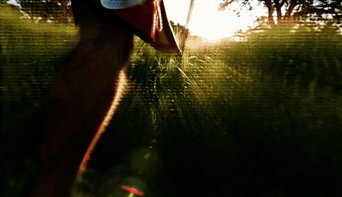
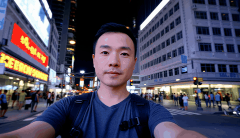
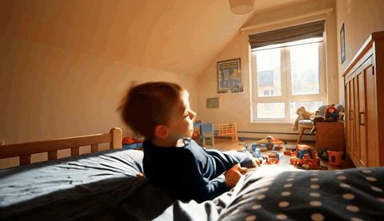

[](static/pdfs/Prompt_Relay__CVPRW_2026_.pdf)
[](https://gordonchen19.github.io/Prompt-Relay/)

> **Note:** This repository is under construction.

<h1 align="center">
  
  Prompt Relay:  Inference-Time Temporal Prompt Routing For Multi-Event Video Generation
</h1>

<p align="center">
  <a href="https://gordonchen19.github.io">Gordon Chen</a>,
   <a href="https://ziqihuangg.github.io">Ziqi Huang</a>,
   <a href="https://liuziwei7.github.io/team.html">Ziwei Liu</a>
</p>

<p align="center">
  <a href="static/videos/Trailer.mov">Trailer.mov</a>
</p>

<p align="center">
  <video src="static/videos/Trailer.mov" controls width="100%"></video>
</p>


## :mega: Overview

Video diffusion models have achieved remarkable progress in generating high-quality videos. However, these models struggle to represent the temporal succession of multiple events in real-world videos and lack explicit mechanisms to control when semantic concepts appear, how long they persist, and the order in which multiple events occur. Such control is especially important for movie-grade synthesis, where coherent storytelling depends on precise timing, duration, and transitions between events. When using a single paragraph-style prompt to describe a sequence of complex events, models often exhibit temporal entanglement, where semantics intended for different moments interfere with one another, resulting in poor text-video alignment. 

**Prompt Relay** is an **inference-time, training-free, plug-and-play** method for fine-grained temporal control in video generation. Given a sequence of temporally constrained prompts, Prompt Relay routes each textual instruction to its intended temporal segment by modifying the cross-attention mechanism with a distance-based penalty.


## Method

The overall goal is to generate a video from a sequence of temporally constrained prompts:

$$
\{(p_s, t_s^{start}, t_s^{end})\}_{s=1}^{N}
$$

where each prompt $p_s$ should be realized only within its designated temporal interval $[t_s^{start}, t_s^{end}]$.

Prompt Relay achieves this by introducing a temporal routing prior directly into cross-attention:

$$
\text{Attn}(Q, K, V) = \text{softmax}\left(\frac{QK^T}{\sqrt{d}} - C(Q, K)\right)V
$$

Here, $C(Q, K)$ is a distance-based penalty that suppresses attention between latent queries inside the segment and prompt tokens that fall outside the intended temporal segment. This encourages each prompt to guide only its designated region of the video, while preventing semantic leakage into neighboring intervals.

This makes Prompt Relay a simple yet effective way to retrofit temporal control onto existing video generation pipelines without retraining the underlying model. Further details are discuessed in the [project page](https://gordonchen19.github.io/Prompt-Relay/) as well as in the paper.

## Qualitative Results

Prompt Relay improves:
- **temporal alignment**, by keeping each instruction localized to its assigned segment,
- **transition naturalness**, by ensuring smooth event handoffs across time,
- **visual quality**, by reducing unnecessary competition in cross-attention.

Prompt Relay consistently outperforms baseline prompting strategies and remains competitive with recent strong models such as **Kling 3.0**. In particular, **Wan 2.2 + Prompt Relay** often produces stronger visual structure and more stable multi-event generation than the base Wan 2.2 model.

| Metric (↓) | Sora (Storyboard) | Kling 2.6 | Veo 3.1 | Wan 2.2 | Wan 2.2 + Prompt Relay (Ours)|
| --- | ---: | ---: | ---: | ---: | ---: |
| Temporal Alignment | 4.67 | 1.30 | 3.93 | 4.00 | **1.10** |
| Transition Naturalness | 4.60 | 4.43 | 1.30 | 3.50 | **1.17** |
| Visual Quality | 3.67 | 2.50 | **2.0** | 4.00 | 2.83 |

*Table 1. Human preference scores for multi-event video generation (lower values indicate better rankings).*

## Qualitative Comparison

The table below compares the two variants for each video shown on the [project page](https://gordonchen19.github.io/Prompt-Relay/).

<table>
  <thead>
    <tr>
      <th>Wan2.2</th>
      <th>Wan2.2 + Prompt Relay (Ours)</th>
    </tr>
  </thead>
  <tbody>
    <tr>
      <td width="50%"></td>
      <td width="50%"></td>
    </tr>
    <tr>
      <td width="50%"></td>
      <td width="50%"></td>
    </tr>
    <tr>
      <td width="50%"></td>
      <td width="50%"></td>
    </tr>
    <tr>
      <td width="50%"></td>
      <td width="50%"></td>
    </tr>
  </tbody>
</table>

## Implementation Details

Prompt Relay takes as input a **global_prompt**, a list of **local_prompts**, and their corresponding **segment_lengths** (Optional). The **global_prompt** conditions the entire video and serves to anchor persistent characters, objects, and scene context across all segments. The **local_prompts** are an ordered list of prompts, each conditioned on a specific temporal segment of the video. The **segment_lengths** define how many latent chunked frames are allocated to each local prompt. Given a video with x real frames, their sum must be (x - 1) // 4 + 1, corresponding to the total number of latent chunked frames used by the model.

We set `epsilon = 1e-3` and use `w = L/2 - 2` where `L` is the segment length for all runs. Under this setting, `sigma` simplifies to `1 / ln(1 / epsilon) ≈ 0.1448`.

Compared with the official Wan2.2 repository, Prompt Relay modifies only the following Python files:

```text
generate.py
wan/image2video.py
wan/modules/model.py
wan/distributed/sequence_parallel.py
```

## Usage

Users can define their prompts in:

```bash
Wan2.2/prompts.json
```

For instance:

```bash
{
  "global_prompt": "A single continuous cinematic shot inside a cozy child's bedroom during the daytime. Warm sunlight streams through the window, toys and books are scattered around the room, and the atmosphere feels lively, playful, and realistic. A young boy is playing in his room.",

  "local_prompts": [
    "A young boy is lying flat on his bed in the middle of his room, staring up at the ceiling.",

    "After a brief moment, he rolls over, pushes himself up, stands on the mattress, and starts jumping on the bed. He bounces up and down repeatedly with excitement, his hair and clothes moving naturally with each jump, while the bed sheets ripple beneath him.",

    "The boy then runs toward a pile of toys near the corner of the room, grabs a toy airplane, and pretends to fly it through the air while making playful swooping motions with his arm. He races in a circle around the room."
  ],
  "segment_lengths": [7,12,14]
}

```

and then run:

```bash
python dbl/Wan2.2/generate.py \
  --task t2v-A14B \
  --ckpt_dir ./Wan2.2-T2V-A14B \
  --offload_model True \
  --convert_model_dtype \
  --frame_num 81 \
  --size "832*480" \
  --prompt_filepath dbl/Wan2.2/prompts.json\
```

If the `--prompt_filepath` argument is not provided, the script runs the baseline Wan2.2 pipeline.
