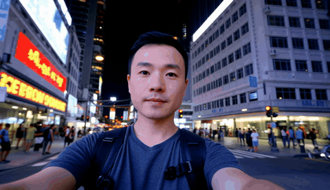
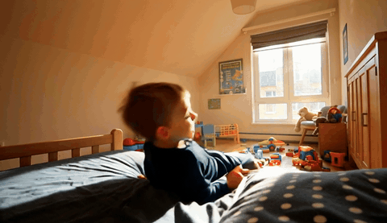

[](https://arxiv.org/abs/2604.10030)
[](https://gordonchen19.github.io/Prompt-Relay/)

<h1 align="center">
  
  Prompt Relay: Inference-Time Prompt Routing for Temporal Control in Multi-Event Video Generation
</h1>

<p align="center">
  <a href="https://gordonchen19.github.io">Gordon Chen</a>,
   <a href="https://ziqihuangg.github.io">Ziqi Huang</a>,
   <a href="https://liuziwei7.github.io/team.html">Ziwei Liu</a>
</p>


## :mega: Overview

Video diffusion models have achieved remarkable progress in generating high-quality videos. However, these models struggle to represent the temporal succession of multiple events in real-world videos and lack explicit mechanisms to control when semantic concepts appear, how long they persist, and the order in which multiple events occur. Such control is especially important for movie-grade synthesis, where coherent storytelling depends on precise timing, duration, and transitions between events. When using a single paragraph-style prompt to describe a sequence of complex events, models often exhibit temporal entanglement, where semantics intended for different moments interfere with one another, resulting in poor text-video alignment. 

**Prompt Relay** is an **inference-time, training-free, plug-and-play** method for fine-grained temporal control in video generation. Given a sequence of temporally constrained prompts, Prompt Relay routes each textual instruction to its intended temporal segment by modifying the cross-attention mechanism with a distance-based penalty.


## Method

The overall goal is to generate a video from a sequence of temporally constrained prompts:

$$
\{(p_s, t_s^{start}, t_s^{end})\}_{s=1}^{N}
$$

where each prompt $p_s$ should be realized only within its designated temporal interval $[t_s^{start}, t_s^{end}]$.

Prompt Relay achieves this by introducing a temporal routing prior directly into cross-attention:

$$
\text{Attn}(Q, K, V) = \text{softmax}\left(\frac{QK^T}{\sqrt{d}} - C(Q, K)\right)V
$$

Here, $C(Q, K)$ is a distance-based penalty that suppresses attention between latent queries inside the segment and prompt tokens that fall outside the intended temporal segment. This encourages each prompt to guide only its designated region of the video, while preventing semantic leakage into neighboring intervals.

This makes Prompt Relay a simple yet effective way to retrofit temporal control onto existing video generation pipelines without retraining the underlying model. Further details are discuessed in the [project page](https://gordonchen19.github.io/Prompt-Relay/) as well as in the paper.

## Qualitative Results

Prompt Relay improves:
- **temporal alignment**, by keeping each instruction localized to its assigned segment,
- **transition naturalness**, by ensuring smooth event handoffs across time,
- **visual quality**, by reducing unnecessary competition in cross-attention.

Prompt Relay consistently outperforms baseline prompting strategies and remains competitive with recent strong models such as **Kling 3.0**. In particular, **Wan 2.2 + Prompt Relay** often produces stronger visual structure and more stable multi-event generation than the base Wan 2.2 model.

| Metric (↓) | Sora (Storyboard) | Kling 2.6 | Veo 3.1 | Wan 2.2 | Wan 2.2 + Prompt Relay (Ours)|
| --- | ---: | ---: | ---: | ---: | ---: |
| Temporal Alignment | 4.67 | 1.30 | 3.93 | 4.00 | **1.10** |
| Transition Naturalness | 4.60 | 4.43 | 1.30 | 3.50 | **1.17** |
| Visual Quality | 3.67 | 2.50 | **2.0** | 4.00 | 2.83 |

*Table 1. Human preference scores for multi-event video generation (lower values indicate better rankings).*

## Qualitative Comparison

The table below compares the two variants for each video shown on the [project page](https://gordonchen19.github.io/Prompt-Relay/).

<table>
  <thead>
    <tr>
      <th>Wan2.2</th>
      <th>Wan2.2 + Prompt Relay (Ours)</th>
    </tr>
  </thead>
  <tbody>
    <tr>
      <td width="50%"></td>
      <td width="50%"></td>
    </tr>
    <tr>
      <td width="50%"></td>
      <td width="50%"></td>
    </tr>
    <tr>
      <td width="50%"></td>
      <td width="50%"></td>
    </tr>
    <tr>
      <td width="50%"></td>
      <td width="50%"></td>
    </tr>
  </tbody>
</table>

## Implementation Details

Prompt Relay takes as input a **global_prompt**, a list of **local_prompts**, and optional timing information. The **global_prompt** conditions the entire video and anchors persistent characters, objects, and scene context. For consecutive events, **segment_lengths** specifies the number of internal latent frames allocated to each local prompt. To cover a video of `x` output frames, the lengths sum to `(x - 1) // 4 + 1`. For overlapping events, use independent **segment_intervals** instead; see [overlapping events](#overlapping-events-wan22-t2v-a14b) below.

For the original consecutive-schedule experiments, we set `epsilon = 1e-3` and use `w = L/2 - 2`, where `L` is the segment length. Under this setting, `sigma` simplifies to `1 / ln(1 / epsilon) ≈ 0.1448`. Explicit overlapping intervals use the decay settings described in the [Wan guide](src/Wan2.2/PROMPT_RELAY.md#attention).

The Wan2.2 T2V implementation is organized in the following Python files:

```text
generate.py
wan/text2video.py
wan/prompt_relay.py
wan/modules/model.py
wan/modules/temporal_routing.py
wan/distributed/sequence_parallel.py
```

## Usage

### Setup

```bash
git clone --branch wan2.2-overlap-only --recurse-submodules https://github.com/GordonChen19/Prompt-Relay.git
cd Prompt-Relay
```

Install the [Wan dependencies](src/Wan2.2/README.md#installation) and download
the [T2V-A14B weights](src/Wan2.2/README.md#model-download). Replace the checkpoint
path in the commands below with your local model directory.

```bash
git submodule sync --recursive
git submodule update --init --recursive
```

For an existing clone, switch to `wan2.2-overlap-only` before running
these submodule commands. Use the versions recorded by this branch. The Wan
implementation is maintained in
[`DasbootU9607/Wan2.2:feat/prompt-relay-overlap`](https://github.com/DasbootU9607/Wan2.2/tree/feat/prompt-relay-overlap).

### Sequential events

Save your prompts in `src/Wan2.2/prompts.json`. For example, the following
schedule divides an 81-frame video into three consecutive segments of seven
internal frames each:

```json
{
  "global_prompt": "A single continuous cinematic shot inside a cozy child's bedroom during the daytime. Warm sunlight streams through the window, toys and books are scattered around the room, and the atmosphere feels lively, playful, and realistic. A young boy is playing in his room.",

  "local_prompts": [
    "A young boy is lying flat on his bed in the middle of his room, staring up at the ceiling.",

    "After a brief moment, he rolls over, pushes himself up, stands on the mattress, and starts jumping on the bed. He bounces up and down repeatedly with excitement, his hair and clothes moving naturally with each jump, while the bed sheets ripple beneath him.",

    "The boy then runs toward a pile of toys near the corner of the room, grabs a toy airplane, and pretends to fly it through the air while making playful swooping motions with his arm. He races in a circle around the room."
  ],
  "segment_lengths": [7, 7, 7]
}

```

From the repository root, run:

```bash
cd src/Wan2.2
python generate.py \
  --task t2v-A14B \
  --ckpt_dir /path/to/Wan2.2-T2V-A14B \
  --offload_model True \
  --convert_model_dtype \
  --frame_num 81 \
  --size "832*480" \
  --prompt_filepath prompts.json
```

If the `--prompt_filepath` argument is not provided, the script runs the baseline Wan2.2 pipeline.

### Overlapping events (Wan2.2 T2V-A14B)

Use `segment_intervals` when events need to happen at the same time. Each
`[start, end)` pair corresponds to one local prompt; the end time is excluded.
For example, the following schedule lets the robber enter the car during
`[0, 3)` seconds while an explosion occurs at the bank during `[2, 4)` seconds:

```json
{
  "global_prompt": "A continuous wide shot outside a bank, with a getaway car in the foreground.",
  "local_prompts": [
    "The robber opens the car door and climbs into the getaway car.",
    "The bank entrance behind the car explodes, with fire and smoke."
  ],
  "segment_intervals": [[0, 3], [2, 4]],
  "time_unit": "seconds"
}
```

Both prompts receive zero temporal penalty during `[2, 3)`. They still share
attention, so this permits simultaneous guidance without guaranteeing that
both events will be generated successfully.

Run the supplied [example JSON](src/Wan2.2/prompt_relay_overlap.json) from the
same `src/Wan2.2` directory:

```bash
python generate.py --task t2v-A14B --ckpt_dir /path/to/Wan2.2-T2V-A14B \
  --size "832*480" --frame_num 81 --offload_model True --convert_model_dtype \
  --prompt_filepath prompt_relay_overlap.json
```

`time_unit` supports `seconds` or `internal_frame` (default). Do not combine
`segment_intervals` with `segment_lengths`, and leave prompt extension disabled
when using Prompt Relay JSON. Without explicit intervals, prompts keep their
original consecutive allocation; this Wan implementation does not infer overlap
from text or support `auto_overlap`.

See the [English guide](src/Wan2.2/PROMPT_RELAY.md) or
[中文说明](src/Wan2.2/PROMPT_RELAY_ZH.md) for interval validation, decay settings,
and tests.

## 📖 Citation
If you find Prompt Relay useful in your research or projects, please consider citing our paper:


```bibtex

@article{chen2026prompt,
  title={Prompt Relay: Inference-Time Temporal Control for Multi-Event Video Generation},
  author={Chen, Gordon and Huang, Ziqi and Liu, Ziwei},
  journal={arXiv preprint arXiv:2604.10030},
  year={2026}
}
```
